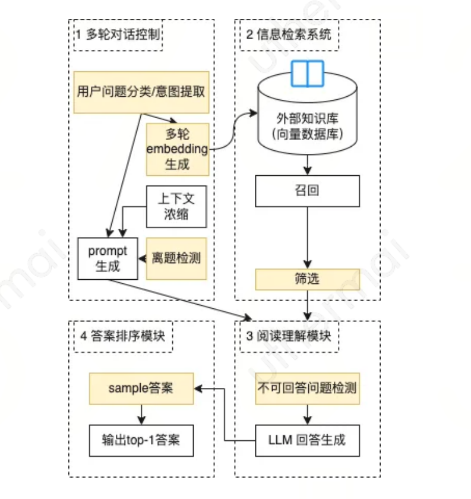

# 背景介绍

目标：结合大语言模型能力，让公司内的私有知识库都具备aichat能力，星云提供统多种文档的知识库的接入（doc/txt/csv/pdf/api等）和embedding能力，前端提供标准sdk的接入插件。

1、微调复杂：模型微调相对复杂，并且效果不可保障，企业内私有知识加入llm模型受限

2、prompt长度受限：chatgpt prompt长度受限，无法一次性将大量知识作为先验知识进行推理

3、数据安全：部分内部知识支持无法直接对外，无法使用chatgpt自己的知识库，部分场景需要加密或使用内部的llm

4、限制外部知识发挥：各场景知识的召回，总结，要求多样，减少模型的自主发挥，做到应答更精准

5、基础技术：知识库中的多路召回，概要提取，文档分割，话题分割等技术是后续autogpt任务拆解，插件开发的基础

# 使用场景
## 智能QA问答
各类型平台QA客服，文档快速学习，需要机器智能化解答

## 专题知识类
特殊场景类型的内部知识，比如音乐知识类，cclickhouse数据分析类

## 业界方案：

